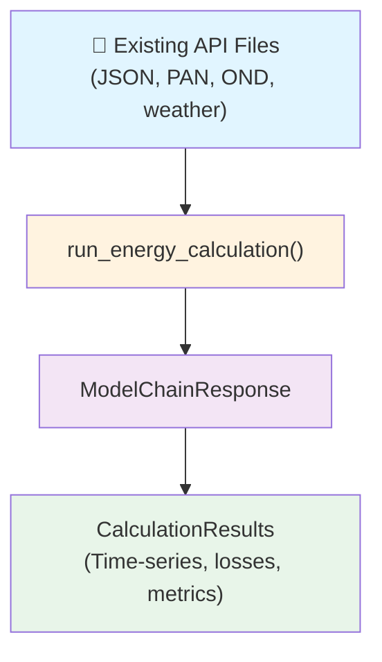

# Workflow 1: Load and Execute Existing API Files

**Best for:** Solar data analysts, engineers with existing SolarFarmer configurations.

**Scenario:** You already have a complete SolarFarmer API payload (typically from the desktop application or previous calculations). You want to run calculations and analyze results using the SDK.

---

## Overview

This workflow involves three steps:

1. **Load** your existing API files (JSON payload, module files, inverter files, weather data)
2. **Execute** the energy calculation via `run_energy_calculation()`
3. **Analyze** results using `ModelChainResponse` and `CalculationResults`

<div align="center" markdown="1">



</div>

---

## Step 1: Prepare Your Files

Your files can be organized in two ways:

### Option A: Single Folder

Organize all inputs in one folder:

```
my_project_inputs/
├── EnergyCalcInputs.json      # Main API payload
├── module.PAN                  # Module specification file
├── inverter.OND                # Inverter specification file
└── weather_data.csv            # Meteorological data (TMY, measurement data, etc.)
```

### Option B: Different Folders

Keep files in separate locations and reference them individually:

```
data/
├── payloads/
│   └── EnergyCalcInputs.json
├── equipment/
│   ├── modules/
│   │   └── module.PAN
│   └── inverters/
│       └── inverter.OND
└── weather/
    └── weather_data.tsv
```

!!! tip
    Generate sample files from the SolarFarmer desktop application or download from
    the [API tutorials](https://mysoftware.dnv.com/download/public/renewables/solarfarmer/manuals/latest/UserGuide/Tutorials/Tutorials.html).

---

## Step 2: Run the Calculation

### Option A: Single Folder

```python
import solarfarmer as sf

project_id = "my_project"
api_key = "your_api_key"  # or set as environment variable SF_API_KEY

folder_with_inputs = r"path/to/my_project_inputs"

# Execute the energy calculation
results = sf.run_energy_calculation(
    inputs_folder_path=folder_with_inputs,
    project_id=project_id,
    api_key=api_key,
    save_outputs=True,
    outputs_folder_path=r"path/to/outputs"
)
```

### Option B: Different Folders

```python
import solarfarmer as sf

project_id = "my_project"
api_key = "your_api_key"  # or set as environment variable SF_API_KEY

# Execute the energy calculation with individual file paths
results = sf.run_energy_calculation(
    energy_calculation_inputs_file_path=r"path/to/EnergyCalcInputs.json",
    meteorological_data_file_path=r"path/to/weather_data.tsv",
    horizon_file_path=r"path/to/horizon.hor",  # Optional
    pan_file_paths=[r"path/to/module.PAN"],
    ond_file_paths=[r"path/to/inverter.OND"],
    project_id=project_id,
    api_key=api_key,
    save_outputs=True,
    outputs_folder_path=r"path/to/outputs"
)
```

**What happens:**

- `run_energy_calculation()` reads your payload and files
- Submits the calculation to the SolarFarmer API
- Returns a `CalculationResults` object containing time-series data, loss breakdown, and summary metrics

---

## Step 3: Access Results

### View Summary

```python
# Print a summary of the results
results.describe()
```

### Access Key Metrics

```python
# Convenience properties (year 1)
print(f"Net Energy: {results.net_energy_MWh:.1f} MWh/year")
print(f"Performance Ratio: {results.performance_ratio:.3f}")
print(f"Specific Yield: {results.energy_yield_kWh_per_kWp:.1f} kWh/kWp")

# Or access full annual data dicts directly
annual_data = results.AnnualData[0]
net_energy_mwh = annual_data['energyYieldResults']['netEnergy']
performance_ratio = annual_data['energyYieldResults']['performanceRatio']
```

### Access Simulation Results

#### View Annual and Monthly Results

Print a formatted summary of annual results:

```python
# Print annual results summary
results.print_annual_results()
```

Print a formatted summary of monthly results:

```python
# Print monthly results summary
results.print_monthly_results()
```

#### Access Time-Series Data

For detailed documentation on loss tree time-series results, refer to the [Loss Tree Time-Series Reference](https://mysoftware.dnv.com/download/public/renewables/solarfarmer/manuals/latest/CalcRef/OutputFiles/LossTreeTimeseries.html){ target="_blank" .external }.

```python
# Get loss tree timeseries results
loss_tree_timeseries = results.loss_tree_timeseries

```

For detailed documentation on PVsyst-format time-series results, refer to the [PVsyst Results Format Reference](https://mysoftware.dnv.com/download/public/renewables/solarfarmer/manuals/latest/CalcRef/OutputFiles/CloudTestingFiles.html#pvsystformatresultstxt){ target="_blank" .external }.

```python
# Get pvsyst-format time-series results
timeseries_data = results.pvsyst_timeseries

```

---

## Step 4: Save and Load Results

### Save Results to Folder

```python
# Save all results to a folder
output_folder = r"path/to/output_folder"
results.to_folder(output_folder_path=output_folder)
```

The following files are automatically generated:

```
output_folder/
├── Annual and Monthly Results.json     # Energy yield and performance data
├── CalculationAttributes.json          # Calculation metadata and configuration
├── LossTreeResults.tsv                 # Detailed loss breakdown results
├── PVsystResults.csv                   # PVsyst-formatted output
└── DetailedTimeseries.tsv              # Hourly time-series data for the irradiance modeling
```

### Load Results from Folder

```python
from solarfarmer.models import CalculationResults

# Load previously saved results
loaded_results = CalculationResults.from_folder(output_folder)

# Access the loaded data
annual_data = loaded_results.AnnualData[0] # accessing the first year (index 0)
net_energy = annual_data['energyYieldResults']['netEnergy']
```

---

## Common Tasks

### Run Multiple Variations (Option A)

```python
folders = [
    "project_v1_inputs",
    "project_v2_inputs",
    "project_v3_inputs"
]

results_list = []
for folder in folders:
    results = sf.run_energy_calculation(
        inputs_folder_path=folder,
        project_id=f"comparison_{folder}",
        api_key=api_key
    )
    results_list.append(results)
# Compare results
for i, results in enumerate(results_list):
    net_energy = results.AnnualData[0]['energyYieldResults']['netEnergy']
    print(f"Variant {i+1}: {net_energy:.1f} MWh")
```

### Run Multiple Variations (Option B)

```python
# Different configurations with separate file locations
configurations = [
    {
        'json': r"configs/v1/EnergyCalcInputs.json",
        'weather': r"data/weather_2022.csv",
        'modules': [r"equipment/Canadian_Solar_330W.PAN"],
        'inverters': [r"equipment/Sungrow_50KW.OND"],
    },
    {
        'json': r"configs/v2/EnergyCalcInputs.json",
        'weather': r"data/weather_2023.csv",
        'modules': [r"equipment/Trina_Solar_375W.PAN"],
        'inverters': [r"equipment/Huawei_50KW.OND"],
    }
]

results_list = []
for i, config in enumerate(configurations):
    results = sf.run_energy_calculation(
        energy_calculation_inputs_file_path=config['json'],
        meteorological_data_file_path=config['weather'],
        pan_file_paths=config['modules'],
        ond_file_paths=config['inverters'],
        project_id=f"comparison_v{i+1}",
        api_key=api_key
    )
# Compare results
for i, results in enumerate(results_list):
    net_energy = results.AnnualData[0]['energyYieldResults']['netEnergy']
    print(f"Configuration {i+1}: {net_energy:.1f} MWh")
```

### Extract Data for Analysis

```python
import pandas as pd

# Create comparison dataframe
comparison = pd.DataFrame({
    'variant': [f"v{i}" for i in range(len(results_list))],
    'net_energy_mwh': [r.AnnualData[0]['energyYieldResults']['netEnergy'] for r in results_list],
    'performance_ratio_pct': [r.AnnualData[0]['energyYieldResults']['performanceRatio'] for r in results_list]
})

print(comparison)
```

---

## Troubleshooting

| Issue | Solution |
|---|---|
| `FileNotFoundError` | **Option A**: Ensure all files (JSON, PAN, OND, weather) are in the `inputs_folder_path`.<br><br>**Option B**: Verify that all file paths (`energy_calculation_inputs_file_path`, `meteorological_data_file_path`, etc.) point to valid files. |
| `API Key Error` | Set `SF_API_KEY` environment variable or pass `api_key` parameter |
| `Valid JSON not found` | **Option A**: File must be named `EnergyCalcInputs.json`.<br><br>**Option B**: Verify the `energy_calculation_inputs_file_path` points to the correct JSON file. |
| `No OND/PAN files found` | **Option A**: Check that inverter (*.OND) and module (*.PAN) files are in the input folder.<br><br>**Option B**: Pass `ond_file_paths` and `pan_file_paths` as lists with valid file paths. |

---

## Next Steps

- **[Learn Workflow 2](workflow-2-pvplant-builder.md)** to design plants from scratch
- **[View Examples](quick-start-examples.md)** for real-world integration patterns
- **[API Reference](../api.md)** for function parameters and details
