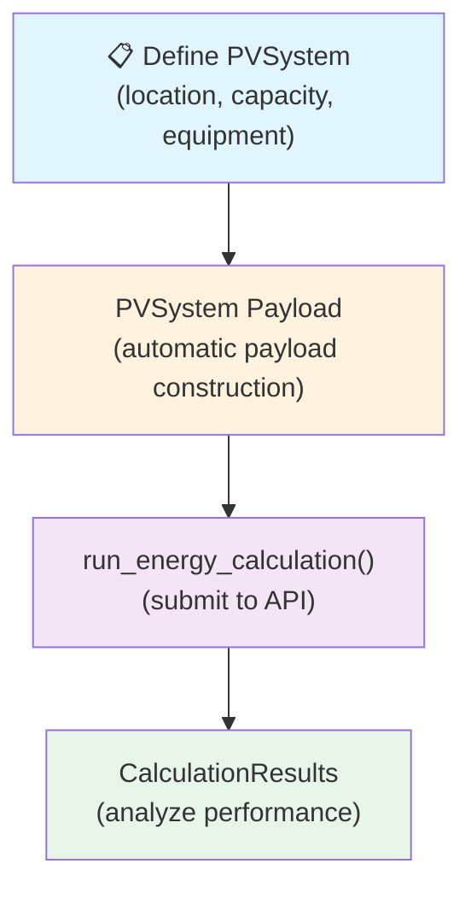

# Workflow 2: Design Plants with PVSystem

**Best for:** Solar engineers, designers, and analysts creating new plant configurations.

**Scenario:** You're designing a new photovoltaic plant and want to define its specifications, automatically construct the API payload, and run energy calculations.

---

## Overview

!!! info "Approximated Design"
    `PVSystem` constructs a plant layout from high-level inputs (location, capacity, equipment files) using simplified assumptions — including uniform mid-row shading for all strings and inferred string sizing. This is well-suited for early-stage yield screening and scenario comparison. For full design fidelity, use [Workflow 1](workflow-1-existing-api-files.md) with a SolarFarmer Desktop–exported payload or [Workflow 3](workflow-3-plantbuilder-advanced.md) for direct data model mapping.

This workflow involves four steps:

1. **Design** your plant using the `PVSystem` class
2. **Configure** location, capacity, equipment, and operational parameters
3. **Generate** the API payload automatically via `PVSystem.produce_payload()`
4. **Calculate** and analyze energy yields

<div align="center" markdown="1">



</div>

---

## Step 1: Create a PVSystem Instance

```python
from solarfarmer import PVSystem

# Create a plant with basic parameters
plant = PVSystem(
    name="My Solar Farm",
    latitude=40.0,
    longitude=-75.0,
    altitude=100.0,
    timezone="America/New_York"
)
```

---

## Step 2: Define Plant Specifications

### Location and Capacity

```python
# PV plant capacity
plant.dc_capacity_MW = 5.0      # DC capacity in MW
plant.ac_capacity_MW = 4.5      # AC capacity in MW (after inverter losses)
plant.grid_limit_MW = 4.8       # Grid connection limit
```

### Array Configuration

```python
# Mounting and orientation
plant.mounting = "Fixed"        # or "Tracker" for single-axis trackers
plant.tilt = 25.0               # Array tilt in degrees
plant.azimuth = 180.0           # South-facing (0=North, 90=East, 180=South, 270=West)
plant.gcr = 0.4                 # Ground coverage ratio (spacing between rows)
plant.flush_mount = False       # Flush-mounted or rack-mounted

# Module orientation
plant.module_orientation = "Portrait"  # or "Landscape"
plant.modules_across = 1        # Number of modules in height direction
```

### Equipment Selection

```python
# Inverter type affects default losses
plant.inverter_type = "Central"  # or "String" inverters

# Transformer configuration
plant.transformer_stages = 1     # 0 (ideal) or 1 (with losses)
```

### Soiling and Albedo Parameters

```python
# Soiling (monthly values)
plant.soiling_loss = [0.08, 0.08, 0.07, 0.06, 0.05, 0.04,
                      0.04, 0.05, 0.06, 0.07, 0.08, 0.09]

# Albedo (ground reflection)
plant.albedo = 0.2              # Can be single value (expanded to 12 months) or list of 12

```

### Bifacial Configuration

```python
plant.bifacial = True           # Enable for bifacial modules
plant.bifacial_transmission = 0.05
plant.bifacial_shade_loss = 0.15
plant.bifacial_mismatch_loss = 0.01
```

---

## Step 3: Add Module and Inverter Files

The SDK uses PAN (module) and OND (inverter) files for detailed specifications:

```python
from pathlib import Path

# Register PAN file (module specification)
plant.add_pan_files({
    "My_Module": Path(r"path/to/module.PAN")
})

# Register OND file (inverter specification)
plant.add_ond_files({
    "My_Inverter": Path(r"path/to/inverter.OND")
})
```

---

## Step 4: Add Weather and Horizon Data

```python
# Meteorological data (required for calculation)
plant.weather_file = Path(r"path/to/weather_data.csv")

# Optional: Horizon data (far-shading from terrain)
plant.horizon_file = Path(r"path/to/horizon_data.hor")

# Or specify horizon angles directly
plant.horizon(
    elevation_angles=[0, 5, 10, 15, 20, 25, 30],
    azimuth_angles=[0, 45, 90, 135, 180, 225, 270, 315]
)
```

---

## Step 5: Review Configuration

```python
# Print a summary of your plant configuration
plant.describe(verbose=True)
```

---

## Step 6: Generate and Save Payload

```python
# Generate the payload
payload = plant.produce_payload()

# Save payload to file for reference
plant.payload_to_file(r"path/to/plant_payload.json")
```

---

## Step 7: Run the Energy Calculation

```python
# Execute the calculation
project_id = "my_plant_design"
api_key = "your_api_key"  # or use SF_API_KEY environment variable

plant.run_energy_calculation(
    project_id=project_id,
    api_key=api_key,
    print_summary=True,
    save_outputs=True,
    outputs_folder_path=r"path/to/results"
)
```

The SDK automatically handles:

- Converting PVSystem specifications to API format
- Calculating string and inverter configurations
- Estimating the number of inverters and modules, and adjusting the provided DC/AC capacities
- Adjusting the losses and effects as per the user inputs or using default values
- Submitting the request to SolarFarmer API

---

## Step 8: Analyze Results

```python
# Access the design produced for the plant object
design_summary = plant.design_summary

# Target vs. actual design capacity
print(f"Target DC Capacity: {design_summary['target_dc_capacity_MW']} MW")
print(f"Target AC Capacity: {design_summary['target_ac_capacity_MW']} MW")
print(f"Design DC Capacity: {design_summary['design_dc_capacity_MW']} MW")
print(f"Design AC Capacity: {design_summary['design_ac_capacity_MW']} MW")

# Component configuration
print(f"Number of Inverters: {design_summary['number_inverters']}")
print(f"Number of Modules: {design_summary['number_modules']}")
print(f"String Length: {design_summary['string_length']} modules")
print(f"Total Strings: {design_summary['total_strings']}")
```

### Evaluate Energy Simulation Results

Use the [`CalculationResults`](../api.md#calculationresults) class to access and analyze the energy simulation results:

```python
# Evaluate the results from the energy simulation
plant.results.performance()

# Access annual data
annual_data = plant.results.AnnualData[0]
net_energy = annual_data['energyYieldResults']['netEnergy']
performance_ratio = annual_data['energyYieldResults']['performanceRatio']

print(f"Net Annual Energy: {net_energy} MWh")
print(f"Performance Ratio: {performance_ratio}%")
```

---

## Common Workflows

### Design Iteration & Optimization

```python
# Create a base design
base_plant = PVSystem(
    name="Base Design",
    latitude=40.0,
    longitude=-75.0,
    dc_capacity_MW=5.0
)

# Try different configurations
configurations = [
    {"tilt": 20, "gcr": 0.3},
    {"tilt": 25, "gcr": 0.35},
    {"tilt": 30, "gcr": 0.4}
]

results = []
for config in configurations:
    plant = base_plant.make_copy()
    plant.name = f"Design - tilt {config['tilt']}°"
    plant.tilt = config['tilt']
    plant.gcr = config['gcr']

    plant.run_energy_calculation(
        project_id=plant.name,
        api_key=api_key
    )

    results.append({
        'tilt': config['tilt'],
        'gcr': config['gcr'],
        'net_energy_mwh': plant.results.AnnualData[0]['energyYieldResults']['netEnergy'],
        'performance_ratio': plant.results.AnnualData[0]['energyYieldResults']['performanceRatio']
    })

# Find optimal configuration
optimal = max(results, key=lambda x: x['net_energy_mwh'])
print(f"Optimal: {optimal}")
```

### Save and Load Plant Configurations

```python
# Save design for later
plant.to_file(r"my_plant_design.json")

# Load and modify
plant_loaded = PVSystem.from_file(r"my_plant_design.json")
plant_loaded.dc_capacity_MW = 6.0
plant_loaded.run_energy_calculation(project_id="modified_design", api_key=api_key)
```

---

## Key Parameters Explained

| Parameter | Meaning | Example |
|---|---|---|
| `gcr` | Ground coverage ratio (area occupied / total area) | 0.4 = 40% |
| `tilt` | Array angle from horizontal. Used for maximum rotation angle for tracker systems. | 25° |
| `azimuth` | Direction array faces (0=N, 90=E, 180=S, 270=W) | 180 = South |
| `mounting` | Fixed-tilt or single-axis tracker systems | "Fixed" or "Tracker" |
| `inverter_type` | Central (single large) or String (multiple small) | "Central" |
| `bifacial` | Are the modules used bifacial? | True / False |

---

## Next Steps

- **[See Workflow 3](workflow-3-plantbuilder-advanced.md)** for manual control over object construction
- **[View Examples](quick-start-examples.md)** for real complete projects
- **[API Reference](../api.md)** for all PVSystem parameters and methods
