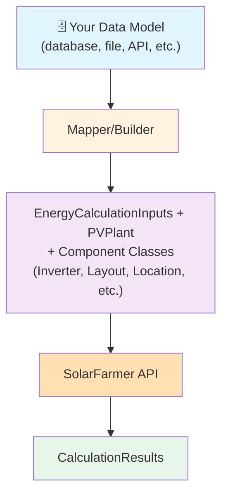

# Workflow 3: Advanced Integration

**Best for:** Software developers, system integrators, and advanced users with specific workflows.

**Scenario:** You're building a software system that needs to integrate SolarFarmer calculations. You want full control over payload construction, data model mapping, or complex multi-step workflows.

---

## Overview

This workflow gives you complete control over API object construction:

1. **Understand** SolarFarmer's API data model
2. **Manually construct** API objects using `EnergyCalculationInputs`, `PVPlant`, and component classes
3. **Map** your data models to SolarFarmer objects
4. **Integrate** calculations into your larger workflow

<div align="center" markdown="1">



</div>

---

## Core Concepts

### EnergyCalculationInputs

`EnergyCalculationInputs` is the root data model that holds the complete API payload. Serialize it with `model_dump_json(by_alias=True, exclude_none=True)` and pass it directly to `run_energy_calculation()`:

```python
from solarfarmer import (
    EnergyCalculationInputs, PVPlant, Location,
    EnergyCalculationOptions, DiffuseModel, MonthlyAlbedo,
)

# Build the top-level inputs object
inputs = EnergyCalculationInputs(
    location=Location(latitude=40.0, longitude=-75.0, altitude=100.0),
    monthly_albedo=MonthlyAlbedo.from_list([0.2] * 12),
    pv_plant=PVPlant(...),
    energy_calculation_options=EnergyCalculationOptions(
        diffuse_model=DiffuseModel.PEREZ,
        include_horizon=False,
    ),
)

# Serialize to JSON (camelCase aliases, no null fields)
api_json = inputs.model_dump_json(by_alias=True, exclude_none=True)
```

### Component Classes

The SDK provides component model classes for every SolarFarmer API object:

```python
from solarfarmer.models import (
    EnergyCalculationInputs, PVPlant, Location,
    Inverter, Layout, Transformer,
    MountingTypeSpecification, TrackerSystem,
    TransformerSpecification, EnergyCalculationOptions,
    AuxiliaryLosses, PanFileSupplements, OndFileSupplements,
    DiffuseModel, HorizonType,
)
```

---

## Step 1: Map Your Data Model

Create a mapping layer between your objects and SolarFarmer objects:

```python
from dataclasses import dataclass
from solarfarmer import Location

# Your data model
@dataclass
class SolarProject:
    name: str
    latitude: float
    longitude: float
    modules_per_string: int
    number_of_strings: int
    inverter_capacity_kw: float
    annual_irradiance: float

class ProjectMapper:
    """Maps your project to SolarFarmer SDK objects"""

    def __init__(self, project: SolarProject):
        self.project = project

    def to_location(self) -> Location:
        return Location(
            latitude=self.project.latitude,
            longitude=self.project.longitude,
            altitude=100.0,
        )

    def calculate_dc_capacity(self) -> float:
        # Your custom calculation
        return self.project.modules_per_string * self.project.number_of_strings * 400  # 400W modules

    def get_module_specs(self) -> dict:
        # Fetch from your database
        return {}
```

---

## Step 2: Manually Build API Objects

Use component classes to construct the payload step by step:

```python
from solarfarmer import (
    EnergyCalculationInputs, PVPlant, Location,
    Inverter, Layout, Transformer,
    MountingTypeSpecification, EnergyCalculationOptions,
    DiffuseModel, MonthlyAlbedo,
)

def build_my_payload(project_mapper: ProjectMapper) -> str:
    """Manually construct SolarFarmer API payload as a JSON string"""

    # 1. Build location
    location = project_mapper.to_location()

    # 2. Build energy calculation options
    calc_options = EnergyCalculationOptions(
        diffuse_model=DiffuseModel.PEREZ,
        include_horizon=False,
        return_pv_syst_format_time_series_results=True,
        return_loss_tree_time_series_results=True,
        apply_spectral_mismatch_modifier=False,
    )

    # 3. Build pvPlant
    pv_plant = _build_pv_plant(project_mapper)

    # 4. Assemble top-level inputs
    inputs = EnergyCalculationInputs(
        location=location,
        monthly_albedo=MonthlyAlbedo.from_list([0.2] * 12),
        pv_plant=pv_plant,
        energy_calculation_options=calc_options,
    )

    return inputs.model_dump_json(by_alias=True, exclude_none=True)

def _build_pv_plant(mapper: ProjectMapper) -> PVPlant:
    """Construct the PVPlant section with your logic"""

    # Create layouts (DC combiner boxes)
    layouts = [
        Layout(
            name="Layout 1",
            layout_count=1,
            inverter_input=[0],
            module_specification_id="mymodule",
            mounting_type_id="Fixed-Tilt",
            total_number_of_strings=mapper.project.number_of_strings,
            string_length=mapper.project.modules_per_string,
            azimuth=180.0,
            # ... more parameters
        )
    ]

    # Create inverter
    inverter = Inverter(
        name="Inverter_1",
        inverter_spec_id="myinverter",
        inverter_count=1,
        layouts=layouts,
        ac_wiring_ohmic_loss=0.01,
    )

    # Create transformer
    transformer = Transformer(
        name="Transformer1",
        transformer_count=1,
        transformer_spec_id="transformer_spec_1",
        inverters=[inverter],
    )

    return PVPlant(
        transformers=[transformer],
        grid_connection_limit=4.5e6,  # 4.5 MW in W
        mounting_type_specifications={
            "Fixed-Tilt": MountingTypeSpecification(
                is_tracker=False,
                number_of_modules_high=1,
                tilt=25.0,
                height_of_lowest_edge_from_ground=1.5,
            )
        },
    )
```

---

## Step 3: Execute and Integrate

```python
import solarfarmer as sf

# Create your customized payload (returns a JSON string)
mapper = ProjectMapper(your_project)
payload_json = build_my_payload(mapper)

# Option 1: Save to file and run via Workflow 1
with open('my_payload.json', 'w') as f:
    f.write(payload_json)

# Option 2: Pass the JSON string directly to run_energy_calculation()
results = sf.run_energy_calculation(
    plant_builder=payload_json,
    project_id="my_project",
    api_key=api_key,
)
```

---

## Advanced Patterns

### Parameterized Payload Factory

Create reusable payload templates:

```python
from solarfarmer import EnergyCalculationInputs, PVPlant, Location, EnergyCalculationOptions, DiffuseModel, MonthlyAlbedo

class PayloadFactory:
    """Factory for generating standardized payloads"""

    @staticmethod
    def create_inputs(
        latitude: float,
        longitude: float,
        capacity_mw: float,
        mounting_type: str = 'fixed',
    ) -> EnergyCalculationInputs:
        """Generate standardized EnergyCalculationInputs from parameters"""

        pv_plant = _build_pv_plant_for_capacity(capacity_mw, mounting_type)

        return EnergyCalculationInputs(
            location=Location(latitude=latitude, longitude=longitude, altitude=0.0),
            monthly_albedo=MonthlyAlbedo.from_list([0.2] * 12),
            pv_plant=pv_plant,
            energy_calculation_options=EnergyCalculationOptions(
                diffuse_model=DiffuseModel.PEREZ,
                include_horizon=False,
            ),
        )

# Usage
inputs = PayloadFactory.create_inputs(
    latitude=40.0,
    longitude=-75.0,
    capacity_mw=5.0,
    mounting_type='fixed',
)
payload_json = inputs.model_dump_json(by_alias=True, exclude_none=True)
```

### Batch Processing Multiple Projects

```python
def batch_calculate(projects: list[dict], api_key: str):
    """Process multiple projects efficiently"""

    results = []

    for project_data in projects:
        project = SolarProject(**project_data)
        mapper = ProjectMapper(project)
        payload_json = build_my_payload(mapper)

        # Save payload (optional)
        payload_file = f"payloads/{project_data['id']}_payload.json"
        Path(payload_file).parent.mkdir(exist_ok=True)
        with open(payload_file, 'w') as f:
            f.write(payload_json)

        # Run calculation by passing the JSON string directly
        result = sf.run_energy_calculation(
            plant_builder=payload_json,
            project_id=project_data['id'],
            api_key=api_key,
        )

        # Extract desired results
        results.append({
            'project_id': project_data['id'],
            'net_energy_mwh': result.AnnualData[0]['energyYieldResults']['netEnergy'],
            'performance_ratio': result.AnnualData[0]['energyYieldResults']['performanceRatio']
        })

    return results
```

### Workflow Orchestration

!!! info
    For production workflows involving multiple API calls, consider using asynchronous functions (async/await) or concurrent programming patterns to improve performance. The example below is synchronous and illustrative; your implementation should handle concurrent requests and network timeouts appropriately.

```python
class SolarDesignWorkflow:
    """Multi-step workflow orchestration"""

    def __init__(self, api_key: str):
        self.api_key = api_key

    def design_and_optimize(self, base_config: dict) -> dict:
        """Design workflow: run multiple variations and find optimal"""

        results = {}

        # Step 1: Run base design
        base_inputs = self._build_inputs(base_config)
        base_result = self._submit(base_inputs, "base_design")
        results['base'] = base_result

        # Step 2: Optimize by tilt angle
        best_tilt = self._optimize_tilt(base_config)
        results['optimal_tilt'] = best_tilt

        # Step 3: Optimize by GCR
        best_gcr = self._optimize_gcr(base_config, best_tilt)
        results['optimal_gcr'] = best_gcr

        # Step 4: Add bifacial analysis
        bifacial_result = self._analyze_bifacial(base_config, best_tilt, best_gcr)
        results['with_bifacial'] = bifacial_result

        return results

    def _build_inputs(self, config: dict) -> EnergyCalculationInputs:
        pass

    def _submit(self, inputs: EnergyCalculationInputs, project_id: str):
        payload_json = inputs.model_dump_json(by_alias=True, exclude_none=True)
        return sf.run_energy_calculation(plant_builder=payload_json, project_id=project_id, api_key=self.api_key)

    def _optimize_tilt(self, config: dict) -> dict:
        # Try different tilts
        pass

    def _optimize_gcr(self, config: dict, tilt: float) -> dict:
        # Try different GCR with optimal tilt
        pass

    def _analyze_bifacial(self, config: dict, tilt: float, gcr: float) -> dict:
        # Compare monofacial vs bifacial
        pass

# Usage
workflow = SolarDesignWorkflow(api_key="your_key")
design = workflow.design_and_optimize(base_config={...})
```

---

## Debugging and Validation

All SDK component classes are Pydantic models, so invalid field types, out-of-range values, and missing required fields raise a `ValidationError` at construction time — before any serialization or API call occurs.

```python
from pydantic import ValidationError
from solarfarmer import Location

try:
    location = Location(latitude=200, longitude=0)  # latitude must be <= 90
except ValidationError as e:
    print(e)
# ValidationError: 1 validation error for Location
# latitude
#   Input should be less than or equal to 90 [type=less_than_equal, input_value=200]
```

This means that if construction of your `EnergyCalculationInputs` object completes without raising, the required structure and field constraints are already satisfied.

!!! warning
    Unknown keyword arguments are silently ignored — Pydantic does not enforce `extra='forbid'` on these models. A misspelled field name will not raise locally; the value will simply be absent from the serialized payload. The server-side validation service is the safeguard for those cases.

!!! note
    All energy calculation API calls are validated upon receipt by the [SolarFarmer API Validation Service](https://mysoftware.dnv.com/download/public/renewables/solarfarmer/manuals/latest/WebApi/Troubleshooting/ValidationService.html){ target="_blank" .external }. This provides an additional layer of error detection and reporting.

---

## Next Steps

- **[Review Workflow 2](workflow-2-pvplant-builder.md)** for comparison
- **[See Examples](quick-start-examples.md)** of advanced integration patterns
- **[API Reference](../api.md)** for all component classes and methods
- **[SolarFarmer API Docs](https://mysoftware.dnv.com/download/public/renewables/solarfarmer/manuals/latest/WebApi/Introduction/introduction.html)** for official API specification
